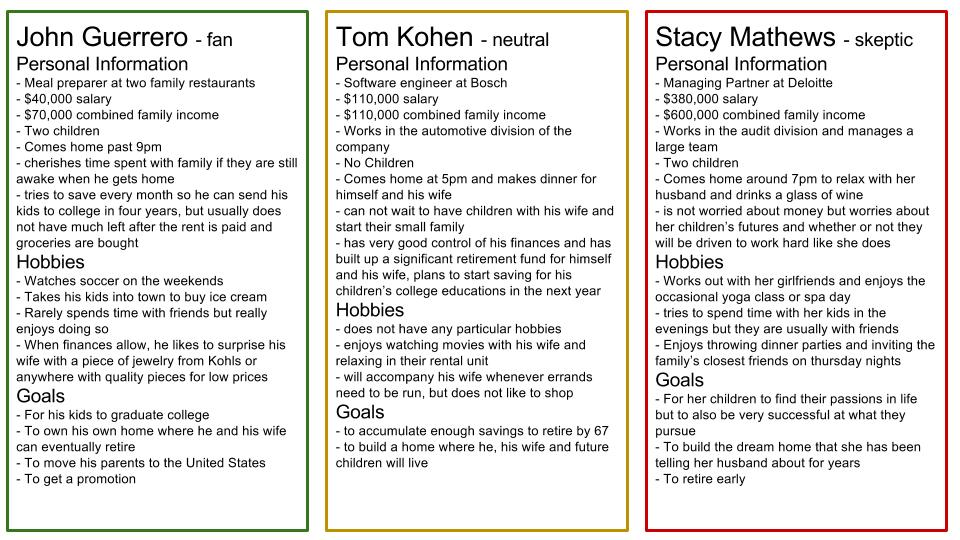

## Personas

## Major Feature
1. Users are able to access a catalog of building materials where each item has a sustainability rating
2. Users are able to easily navigate through a step by step tutorial or checklist that will help them easily build their own house
3. Users are able to browse a directory of contractors that perform work at discounted prices

## Users Flow Process for Each Feature 
1. Catalog feature and sustainability rating
    * Home page
    * Products button 
    * Filter options 
    * List view

2. Tutorial feature
    * Home page 
    * "Build my Home" button
    * Question prompts and onboarding (gathering detailed info about the user’s needs)
    * Separate page that houses all of the steps to be taken and those already completed

3. Contractor directory feature
    * Home page 
    * "Find a Pro" button 
    * List with filter and sort options 
